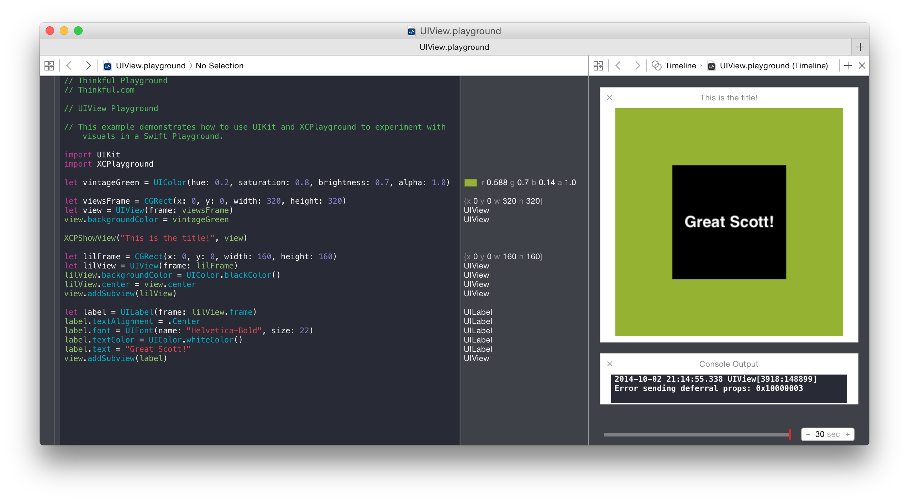

# UIView Playground

This example demonstrates how to use UIKit and XCPlayground to experiment with visuals in a Swift Playground.

# Notes

This project is part of Thinkful's course [Intro to iOS Programming in Swift](http://thinkful.com)